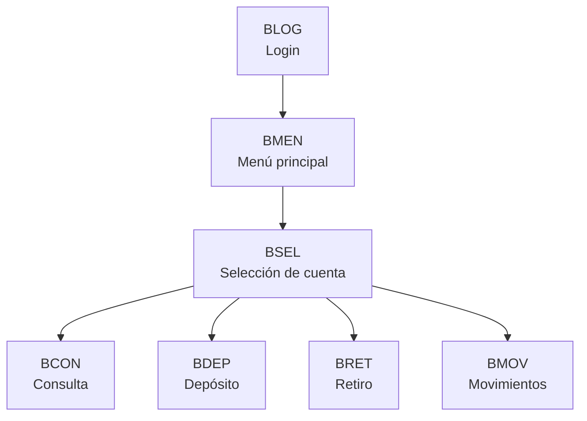
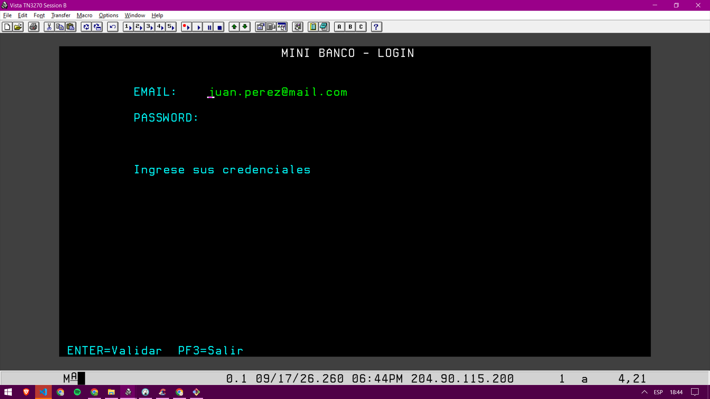
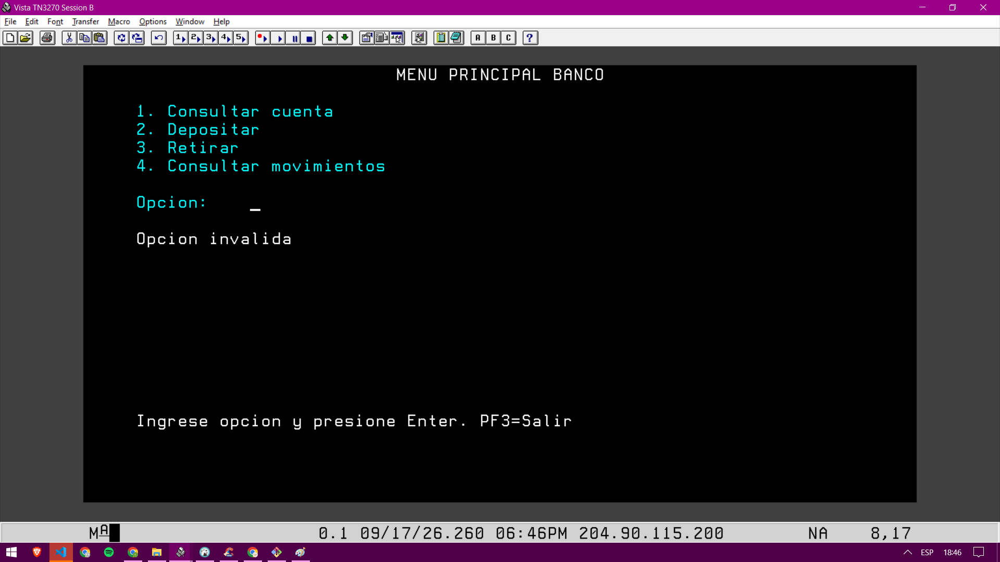
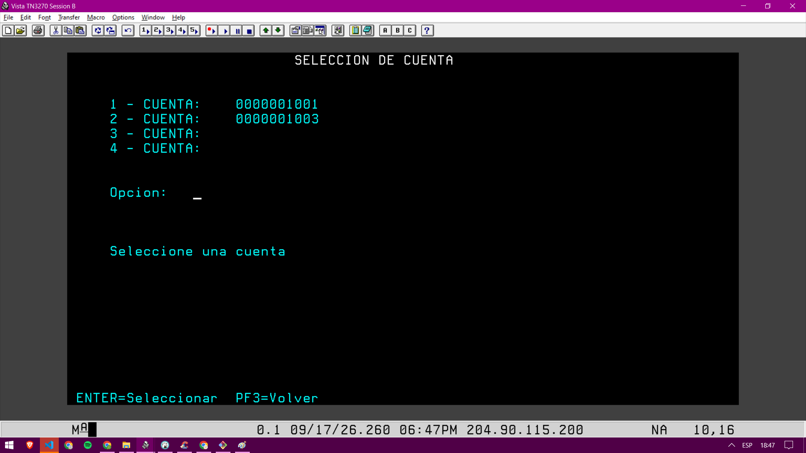
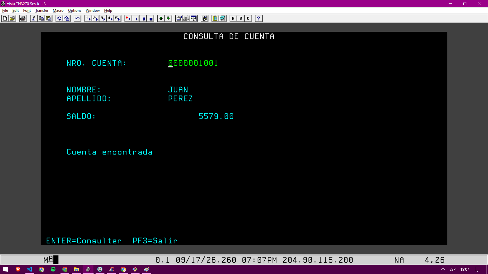

# Banco Digital Mainframe

## Índice

- [Proyecto](#proyecto)
- [Contexto del negocio](#contexto-del-negocio)
- [Objetivo](#objetivo)
- [Funcionalidades principales](#funcionalidades-principales)
- [Flujo de la aplicación](#flujo-de-la-aplicacion)
- [Stack tecnológico](#stack-tecnologico)
- [Valor del proyecto](#valor-del-proyecto)
- [Perfil profesional que refleja](#perfil-profesional-que-refleja)
- [Conclusión](#conclusion)
- [Contacto](#contacto)

## Proyecto

Aplicación bancaria transaccional desarrollada en entorno mainframe para simular operaciones esenciales de gestión de cuentas: autenticación, consulta de saldo, depósitos, retiros y consulta de historial de movimientos.

Este proyecto forma parte de mi portfolio profesional como ejemplo de trabajo con sistemas empresariales, lógica de negocio financiera y desarrollo en entornos transaccionales.

---

## Contexto del negocio

La solución representa un escenario real de banca digital en el que un cliente puede acceder a su cuenta, consultar información financiera y ejecutar operaciones básicas dentro de una experiencia guiada por pantallas.

La idea principal fue recrear un flujo bancario funcional, con validaciones, navegación entre pantallas y manejo seguro de operaciones críticas, reflejando la lógica que se utiliza en aplicaciones financieras de alto impacto.

---

## Objetivo

Diseñar una aplicación bancaria orientada a procesos reales, con foco en:

- experiencia del usuario
- consistencia de operaciones
- seguridad en transacciones
- integración con persistencia de datos
- funcionamiento en entorno enterprise

---

## Funcionalidades principales

- Autenticación de usuario
- Selección de cuenta
- Consulta de saldo
- Depósitos
- Retiros
- Consulta de movimientos
- Navegación por pantallas transaccionales

---

## Flujo de la aplicación

La navegación de la solución se estructura de la siguiente manera:

- `BLOG`: autenticación del usuario
- `BMEN`: menú principal
- `BSEL`: selección de cuenta
- `BCON`: consulta de saldo
- `BDEP`: depósito
- `BRET`: retiro
- `BMOV`: historial de movimientos

La navegación entre transacciones se realiza mediante `COMMAREA`, que permite conservar el estado de la sesión, el titular autenticado y la cuenta seleccionada al pasar de una pantalla a otra dentro del flujo transaccional de CICS.

A continuación, una vista representativa del flujo principal:

---

## Stack tecnológico

- COBOL
- CICS
- Transacciones
- GROUP
- DB2 BIND
- DB2
- Mainframe
- BMS / pantallas transaccionales
- SQL

---

## Valor del proyecto

Este proyecto demuestra mi capacidad para trabajar con:

- lógica de negocio aplicada a entornos financieros
- desarrollo en sistemas transaccionales
- integración de interfaz, procesos y base de datos
- gestión de operaciones críticas con alto requerimiento de confiabilidad
- soluciones orientadas a negocios reales y procesos empresariales

---

## Perfil profesional que refleja

Este trabajo evidencia habilidades en:

- diseño de procesos de negocio
- validación y control de flujo de usuario
- análisis de requerimientos financieros
- trabajo con aplicaciones de misión crítica
- desarrollo en plataformas mainframe

---

## Conclusión

Este proyecto representa una solución bancaria funcional y bien estructurada, pensada para mostrar cómo se aborda el desarrollo de software en entornos corporativos, con foco en la experiencia de usuario, la integridad de datos y la robustez operativa.

Es un ejemplo claro de mi enfoque hacia soluciones empresariales, transaccionales y alineadas con escenarios reales del sector financiero.

---

## Contacto

- Email: torreroberto1996@gmail.com
- Celular: +54 11 6491 310
- LinkedIn: https://www.linkedin.com/in/torre-roberto/
